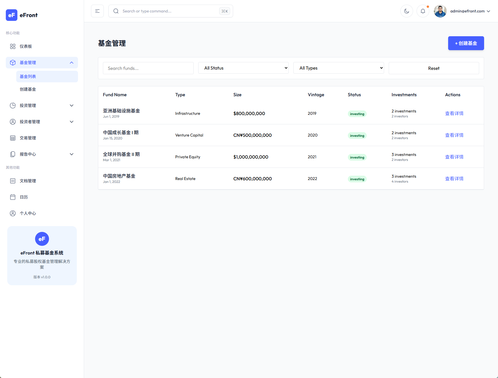
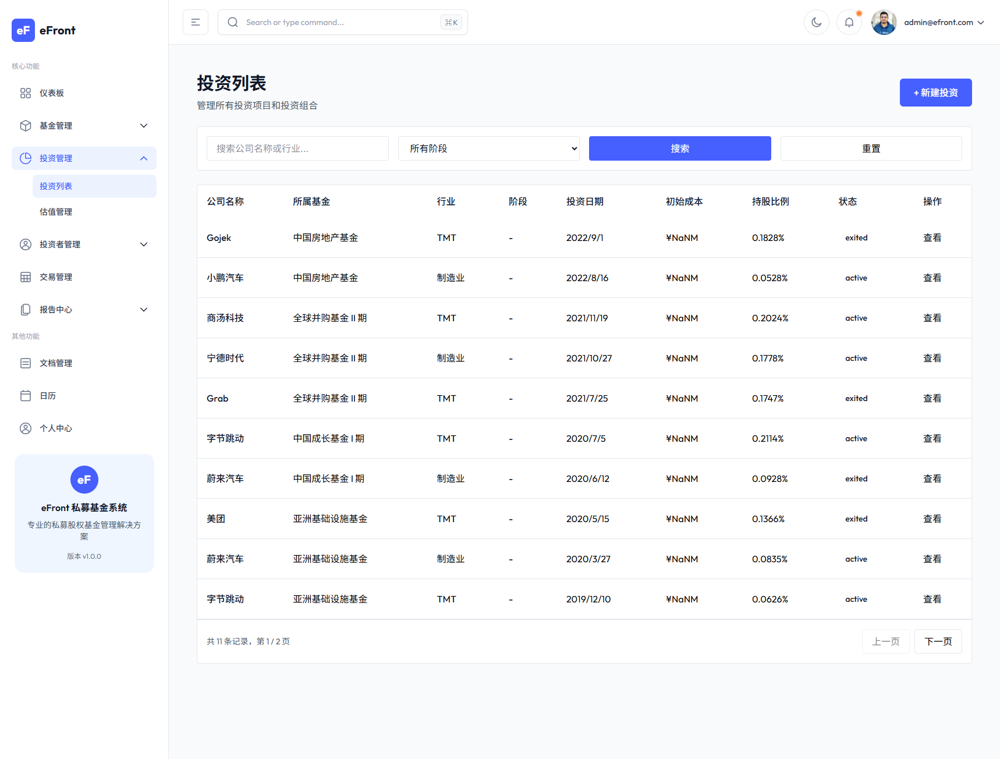
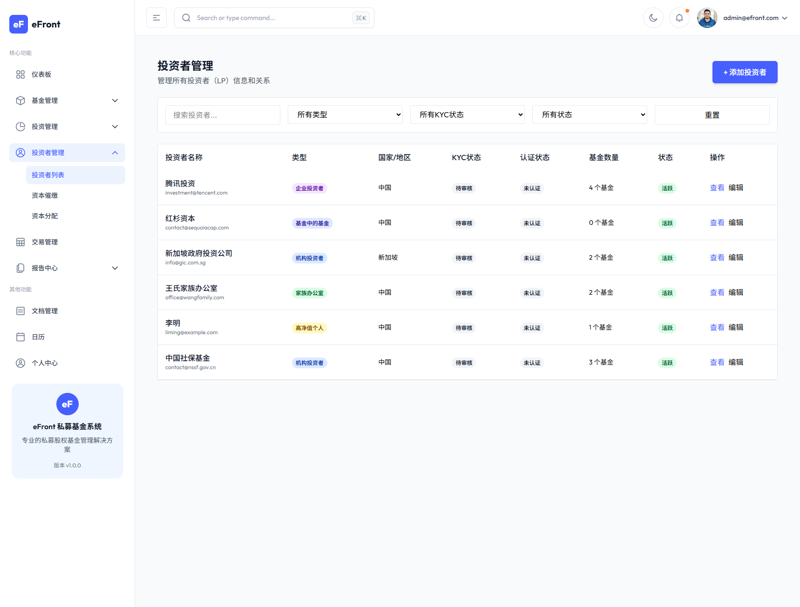
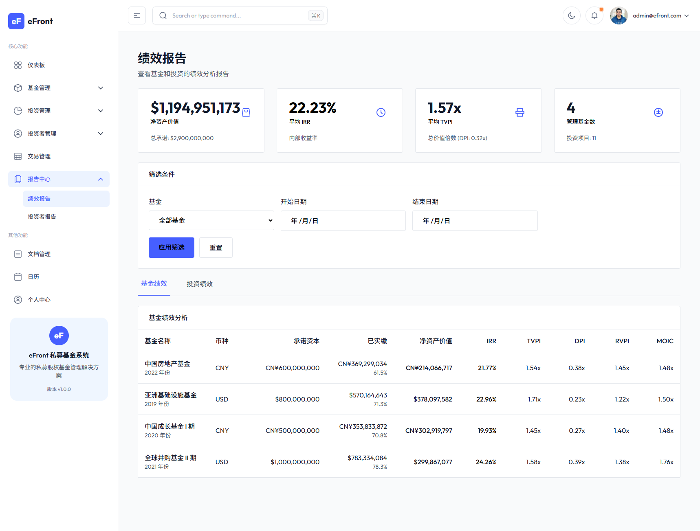
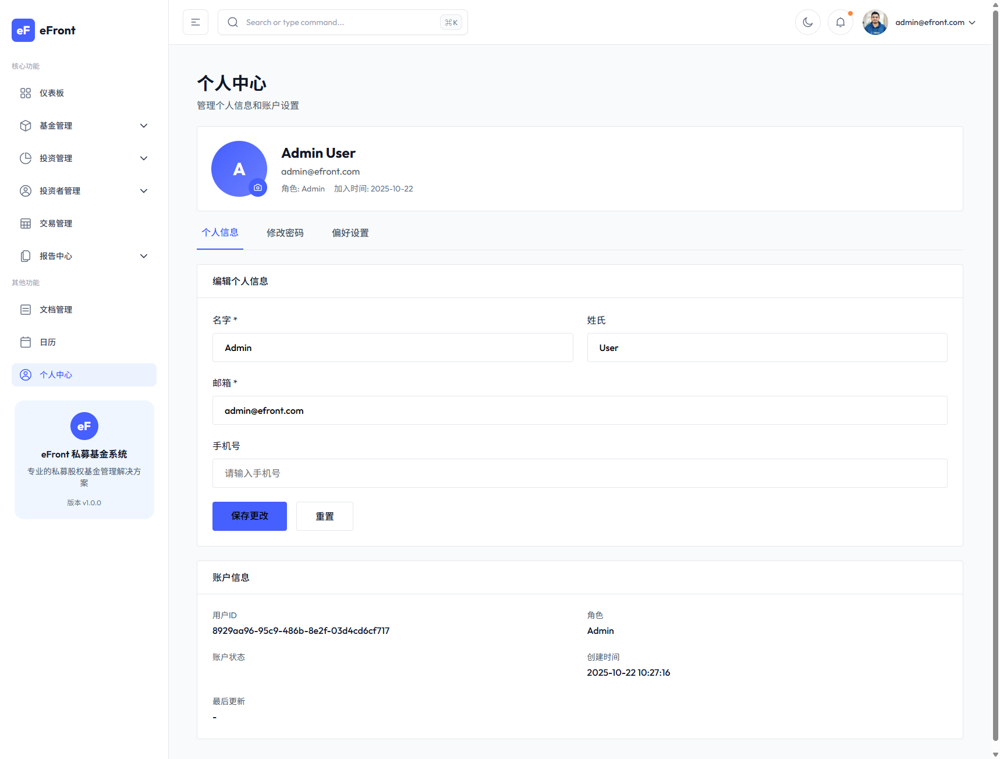

# 2025 · GitHub 年终总结（cokepoppy）

生成时间：2026-02-11（UTC） · 数据来源：cokepoppy 组织下公开仓库（共 21 个）

  2025 新建：12
  2025 有推送：12
  总 Stars：182
  总 Forks：42
  <a class="badge" href="https://github.com/cokepoppy/github-yearly-summary">Repo</a>

## 目录

- [Stars Top](#stars-top)
- [时间线（按创建时间）](#时间线按创建时间)
- [年度主线（归类）](#年度主线归类)
- [项目精选（含截图）](#项目精选含截图)
- [2026 年补充（含截图）](#2026-年补充含截图)
- [一句话总结](#一句话总结)

---

## Stars Top

1. **154** ⭐  [my-quant](https://github.com/cokepoppy/my-quant) — 一个量化交易系统
2. **14** ⭐  [coke-nof1](https://github.com/cokepoppy/coke-nof1) — nof1.ai 官网复刻
3. **5** ⭐  [trade-app](https://github.com/cokepoppy/trade-app) — 一个股票交易app
4. **1** ⭐  [coke-famer](https://github.com/cokepoppy/coke-famer) — 复刻星露谷
5. **1** ⭐  [coke-moltbook-v2](https://github.com/cokepoppy/coke-moltbook-v2) — Moltbook clone (API + Web) with Google/M3 UI skin + agent automation via Clawdbot cron
6. **1** ⭐  [simple-spec](https://github.com/cokepoppy/simple-spec) — 简化版本的 open spec 规约编程框架
7. **1** ⭐  [coke-hyperliquid](https://github.com/cokepoppy/coke-hyperliquid) — hyperliquid 官网复刻
8. **1** ⭐  [coke-efront-v5](https://github.com/cokepoppy/coke-efront-v5) — efront 私募运营系统复刻

---

## 时间线（按创建时间）

| 月份 | 新建仓库 |
|---|---|
| 2025-07 | [trade-app](https://github.com/cokepoppy/trade-app) |
| 2025-08 | [my-quant](https://github.com/cokepoppy/my-quant) |
| 2025-09 | [my-twitter](https://github.com/cokepoppy/my-twitter) |
| 2025-10 | [vue-express-app](https://github.com/cokepoppy/vue-express-app)、[coke-binance](https://github.com/cokepoppy/coke-binance)、[coke-efront](https://github.com/cokepoppy/coke-efront)、[coke-efront-v3](https://github.com/cokepoppy/coke-efront-v3)、[coke-efront-v5](https://github.com/cokepoppy/coke-efront-v5) |
| 2025-11 | [coke-nof1](https://github.com/cokepoppy/coke-nof1)、[coke-hyperliquid](https://github.com/cokepoppy/coke-hyperliquid) |
| 2025-12 | [coke-blog](https://github.com/cokepoppy/coke-blog) |
| 2026-01 | [coke-comic](https://github.com/cokepoppy/coke-comic)、[coke-skywork](https://github.com/cokepoppy/coke-skywork)、[coke-gemini](https://github.com/cokepoppy/coke-gemini)、[simple-spec](https://github.com/cokepoppy/simple-spec)、[coke-clawdbot](https://github.com/cokepoppy/coke-clawdbot) |
| 2026-02 | [coke-moltbook-v2](https://github.com/cokepoppy/coke-moltbook-v2)、[mini-claw-demo](https://github.com/cokepoppy/mini-claw-demo)、[coke-famer](https://github.com/cokepoppy/coke-famer) |

---

## 年度主线（归类）

  

### 1) 量化 / 交易系统与工具链

- 主体是 **my-quant**：Vue3 + Express 的量化交易平台雏形，覆盖数据获取、策略、回测、监控、账户/订单等模块。
- 周边是若干交易相关小项目：**trade-app**、**coke-binance**、**coke-hyperliquid**。

  

  

### 2) 前端 / 网站复刻与页面工程

- **coke-nof1**：nof1.ai 官网复刻（并获得一定 Star），偏“快速还原 + 工程化落地”。
- **coke-efront 系列（efront / v3 / v5）**：同方向的多迭代，体现不断重构、提纯架构与交互。
- **my-twitter**：Twitter/X 风格页面与交互练习。

  

  

### 3) Agent / 工具化 / 自动化（延伸到 2026）

- **simple-spec**：简化版“规约编程 / Open Spec”框架化尝试。
- **coke-moltbook-v2**：Moltbook clone（API + Web）并提到用 cron 做 agent automation。
- **coke-gemini / coke-skywork / mini-claw-demo**：demo/集成/实验性质，把新工具快速跑通并具象化。

  

---

## 项目精选（含截图）

### trade-app

  
链接

<a href="https://github.com/cokepoppy/trade-app">https://github.com/cokepoppy/trade-app</a>

  
定位

股票交易 App（多页面流程）

  
展开截图（11）

  

    
    
    
    
    
    
    
    
    
    
    
  

### my-quant

  
链接

<a href="https://github.com/cokepoppy/my-quant">https://github.com/cokepoppy/my-quant</a>

  
定位

Vue3 + Express 的量化交易平台雏形（策略 / 回测 / 监控 / 账户订单）

  
展开截图（13）

  

    
    
    
    
    
    
    
    
    
    
    
    
    
  

### coke-efront-v5

  
链接

<a href="https://github.com/cokepoppy/coke-efront-v5">https://github.com/cokepoppy/coke-efront-v5</a>

  
定位

私募运营系统复刻（多模块后台）

  
展开截图（10）

  

    
    
    
    
    
    
    
    
    
    
  

---

## 2026 年补充（含截图）

  

### 2026 总览

- 2026 新建仓库：**9**
- 2026 有推送：**9**
- 2026 新建仓库当前 Stars 合计：**3**

  

  

### 2026 代表项目

- [coke-skywork](https://github.com/cokepoppy/coke-skywork)
- [coke-gemini](https://github.com/cokepoppy/coke-gemini)
- [coke-moltbook-v2](https://github.com/cokepoppy/coke-moltbook-v2)
- [coke-famer](https://github.com/cokepoppy/coke-famer)

  

### coke-famer（2026）

  
展开截图（3）

  

    
    
    
  

### coke-gemini（2026）

  
展开截图（7）

  

    
    
    
    
    
    
    
  

### coke-moltbook-v2（2026）

  
展开截图（3）

  

    
    
    
  

### coke-skywork（2026）

  
展开截图（1）

  

    
  

---

## 一句话总结

2025 的主线是：**围绕“交易/量化”做体系化平台 + 围绕“前端工程/复刻”做快速产出**；到 2026 年，你开始把 **agent / 自动化 / 规约化** 纳入工具链，项目从“能跑”走向“可复用、可自动化”。
